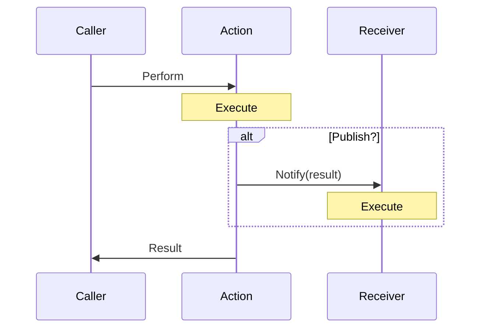

# Coattail

## Architecture

## Me trying to explain what the hell this is

Maybe it's a PuSub style remote execution and communication mechanism for a distributed system built on a peer-to-peer architecture.
Could be practical implemented as a communication mechanism for microservices as a competitor to gRPC or REST.

### Actions & Receivers

Actions and receivers are small blocks of code that you integrate in your Coattail instance. They are the building blocks of the Coattail system.

* Actions can be performed by any one of the following:

    1. **The administrator** (via the CLI)
    2. **A receiver on the local Coattail instance** (Unauthenticated)
    3. **A peering Coattail instance** (Must have permission to perform the action)

* Actions & Receivers Can:

    * Optionally be enabled to have access to the host file system.
    * Access the host Coattail instance to:
        * Perform actions on the local Coattail instance
        * Execute authorized actions on the peering Coattail instances

* When an action is performed:

    * The action can optionally require that it's caller provide it with some input data.
    * The action will execute whatever code you have configured it to run.
    * The action, if publication has not been disabled when it was executed, will notify subscribers with the resulting data.
    * The action will return the resulting data to the caller.
    * The action can be queried by subscribed receivers to get the format of it's output data.

* When a notification is received:

    * The receiver acts as a delegate to handle the notification.
    * The receiver will accept the input data in the format specified by the action.
    * The receiver will execute whatever code you have configured it to run.
    * The receiver does not generate output data.
    * The receiver can optionally execute actions on either the local Coattail instance without authentication.
    * The receiver can optionally execute actions on another peering Coattail instance, but must have permission to do so.