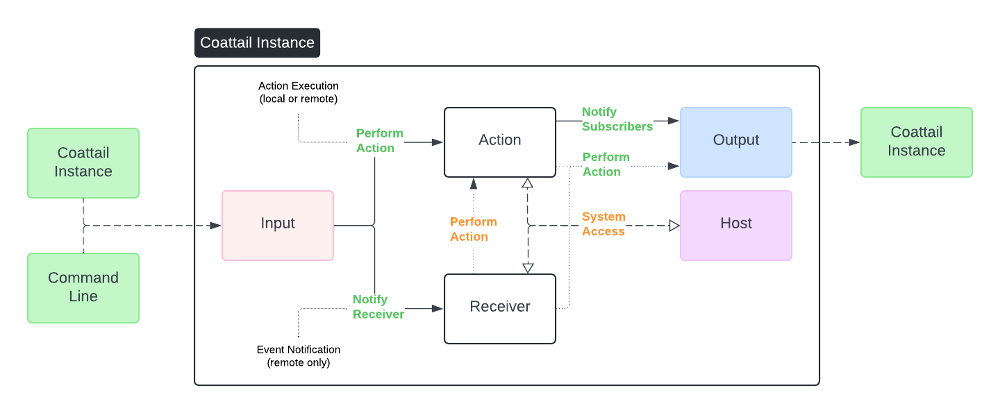

# Coattail

> A Distributed Event-Driven Orchestration Framework for Scalable Automation

Coattail is a powerful framework designed to orchestrate workflows, automate tasks, and manage distributed systems. It leverages an event-driven architecture to execute actions and notify instances, enabling seamless scalability and flexibility.

[Click here to learn more about Coattail](docs/getting-started.md)

## Features

**Distributed Architecture**
- Interconnect multiple Coattail instances for task distribution and scalability.
- Efficient communication between instances for coordinated workflows.

**Event-Driven**
- Trigger workflows and actions based on events.
- Decoupled components for modularity and flexibility.

**Orchestration**
- Coordinate complex workflows using action chaining and dependency management.
- Notify subscribers of completed actions and results.

**Scalability**
- Stateless components enable horizontal scaling.
- Low-latency communication ensures performance under high workloads.

**Automation**
- Define declarative workflows to automate repetitive or complex processes.
- Integrate seamlessly with external APIs and systems.