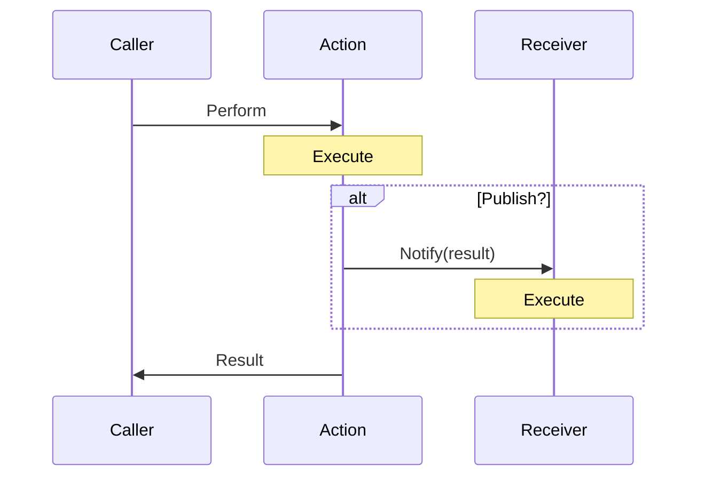

# Coattail

## What is Coattail?

It's a peer-to-peer communication protocol designed for microservices within distributed systems. It allows services to directly communicate with each other as peers, similar to gRPC but more streamlined and P2P-focused.

## Install

```bash
$ go install github.com/nathan-fiscaletti/coattail-go/cmd/coattail@latest
```

## Creating a new Coattail instance

```bash
$ mkdir ct-instance && cd ct-instance
$ coattail new .
```

## Running a Coattail instance

1. Using [Task](https://taskfile.dev/) (See `./Taskfile.yaml` in your Coattail instance)

   ```bash
   $ cd ct-instance
   $ task run
   ```

2. Running directly

   ```bash
   $ cd ct-instance
   $ go run ./cmd
   ```

## Architecture


### Actions & Receivers

Actions and receivers are small blocks of code that you integrate in your Coattail instance. They are the building blocks of the Coattail system.

