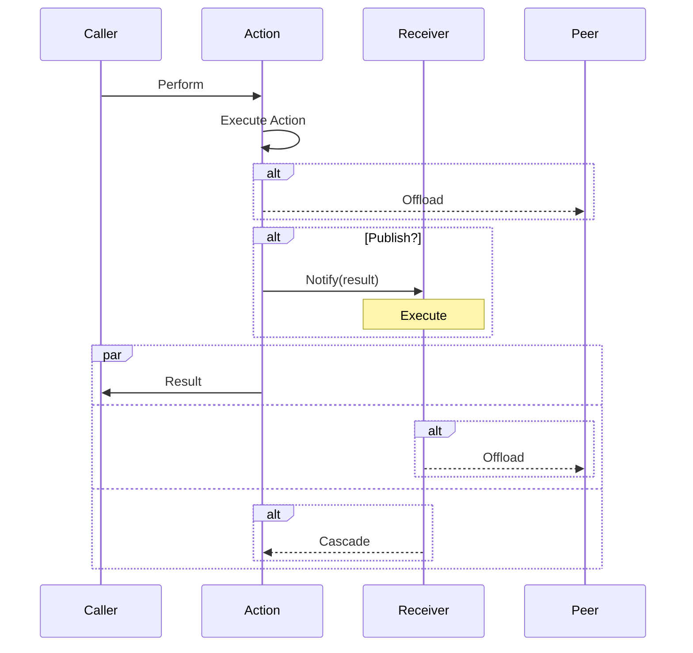

# Coattail: Getting Started

**A Distributed Event-Driven Orchestration Framework for Scalable Automation**

Coattail is a powerful framework designed to orchestrate workflows, automate tasks, and manage distributed systems. It leverages an event-driven architecture to execute actions and notify instances, enabling seamless scalability and flexibility.

> ⚠️ This project is currently in the early stages of development. Please do not use it in production.

## Index

- [Installing Coattail](#installing-coattail)
- [Creating your first Coattail service](#creating-your-first-coattail-service)
- [Architecture](#architecture)
- [Actions & Receivers](#actions--receivers)
  - [I/O Types](#io-types)
  - [Actions](#actions)
    - [Creating an Action](#creating-an-action)
    - [Executing an Action](#executing-an-action)
  - [Receivers](#receivers)
    - [Creating a Receiver](#creating-a-receiver)
    - [Subscribing to an Action with a Receiver](#subscribing-to-an-action-with-a-receiver)
- [Next Steps](#next-steps)
  - [Coattail Rest API](#coattail-rest-api)
  - [Coattail Web UI](#coattail-web-ui)
  - [Coattail CLI](#coattail-cli)

## Installing Coattail

Coattail has a companion CLI tool that can be used to create and manage Coattail services. To install the CLI, run the following command:

```bash
$ go install github.com/nathan-fiscaletti/coattail-go/cmd/coattail@latest
```

While the CLI utility is not required, and you can technically create a Coattail instance manually using the Coattail go library, it is highly recommended to use the CLI utility to create and manage Coattail instances as it has built-in support for generating the necessary files and managing the Coattail instance.

## Creating your first Coattail service

To create a new Coattail instance, run the following command:

```bash
$ mkdir ct-service
$ coattail new ./ct-service github.com/my-company/my-service
```

This will create a new Coattail instance in the `ct-service` directory with the specified package name.

## Architecture


## Actions & Receivers

Each service implements it's own execution units, which are the building blocks of the Coattail system. These units can be executed by any Coattail instance, and can be used to implement any business logic.

Each execution unit is either an **Action** or a **Receiver**. 



### I/O Types

Actions and Receivers cannot be created without the required types. These are used for the input and output types of the Actions and Receivers. They should be created in the `pkg/types` package. Make sure each type is registered with the `gob` package.

**Example Request**

```go
package types

import "encoding/gob"

func init() {
	gob.Register(Request{})
}

type Request struct {
    Name string
}
```

**Example Response**

```go
package types

import "encoding/gob"

func init() {
	gob.Register(Response{})
}

type Response struct {
    Message string
}
```

### Actions

Actions are used to perform tasks or operations on the host system. They can be executed from any number of callers.

These callers include
  - Peering Coattail instances, either: 
  - Through the SDK provided by the hosting Coattail instance using a secure TCP connection
  - Directly over a secure TCP connection without the aid of the SDK
  - Through the Web UI, REST API or CLI (if applicable)

**Attributes of an Action include**

  - Represents tasks or operations that the system can perform.
  - These actions are executed locally or sent to remote instances for distributed execution.
  - Subscribers will be notified when an action is executed.

```go
type Action[
	A any,
	R any,
] interface {
	Execute(args *A) (R, error)
}
```

#### Creating an Action

Note: Before creating an Action, you must first [create the required types](#io-types) in the `pkg/types` package.

To create an action:

1. Add the action to the `actions.yaml` file in the root of your Coattail instance. This file is used to register the action with the hosting Coattail instance.

   ```yaml
   actions:
     - name: MyAction
       input: types.Request
       output: types.Response
   ```

2. Generate the necessary files for the action to be registered with the hosting Coattail instance by running the following command.

   ```sh
   $ coattail generate
   ```

3. This will create a file in the `internal/actions` package called `action.myaction.go`. You should update this file to implement your action. Here is an example using the `Request` and `Response` types that we [created earlier](#io-types).

   ```go
   type MyAction struct{}
   
   func (a *MyAction) Execute(arg *types.Request) (types.Response, error) {
   	return types.Response{
   		Message: fmt.Sprintf("Hello, %s!", arg.Name),
   	}, nil
   }
   ```

4. Your `registry.go` file will also automatically be updated to register the action with the hosting Coattail instance.

   ```go
   . . .
   
   err = local.RegisterAction(ctx, "MyAction", coattailtypes.NewAction[types.Request , types.Response](&actions.MyAction{}))
   if err != nil {
       return err
   }
   
   . . .
   ```

#### Executing an Action

- [TODO: Executing an Action](#)

### Receivers

Receivers differ from Actions in that they are exclusively used for receiving publications from remote Coattail instances. They cannot be remotely executed except through a publication, and they return no data to their caller.

> Note: **Receiving a publication should not be interpreted as a response to an action being executed.** While receivers cannot be directly executed like actions, publication data can be generated by a peering Coattail instance without the associated Action being executed. This will happen when data is manually published to a receiver.

**Attributes of a Receiver include**

  - Handles incoming notifications or events from remote Coattail instances.
  - Ensures the system can process remote communications and respond or delegate tasks.
  - Is capable of executing locally or sending tasks to remote instances for distributed execution.

```go
type Receiver[A any] interface {
	Execute(*A) error
}
```

#### Creating a Receiver

To create a receiver:

1. Add the receiver to the `receivers.yaml` file in the root of your Coattail instance. This file is used to register the receiver with the hosting Coattail instance.

   ```yaml
   receivers:
     - name: MyReceiver
       input: types.Response
   ```

2. Generate the necessary files for the receiver to be registered with the hosting Coattail instance by running the following command.

   ```sh
   $ coattail generate
   ```

3. This will create a file in the `internal/receivers` package called `receiver.myreceiver.go`. You should update this file to implement your receiver. Here is an example using the `Response` type that we [created earlier](#io-types).

   ```go
   type MyReceiver struct{}
   
   func (a *MyReceiver) Execute(arg *types.Response) error {
   	fmt.Println(arg.Message)
   }
   ```

4. Your `registry.go` file will also automatically be updated to register the receiver with the hosting Coattail instance.

   ```go
   . . .

   err = local.RegisterReceiver(ctx, "MyReceiver", coattailtypes.NewReceiver[types.Response](&receivers.MyReceiver{}))
   if err != nil {
       return err
   }

   . . .
   ```

#### Subscribing to an Action with a Receiver

- [TODO: Subscribing to an Action](#)

## Next Steps

### Coattail Rest API

- [TODO: Coattail Rest API](#)

### Coattail Web UI

- [TODO: Coattail Web UI](#)

### Coattail CLI

- [TODO: Coattail CLI](#)